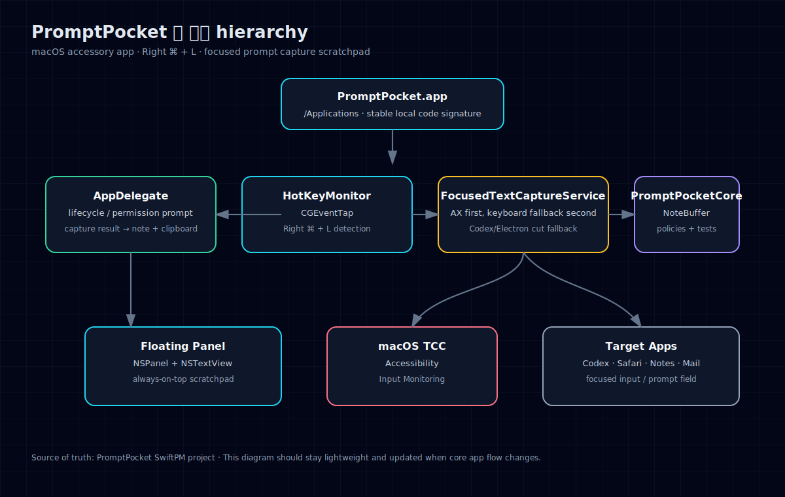
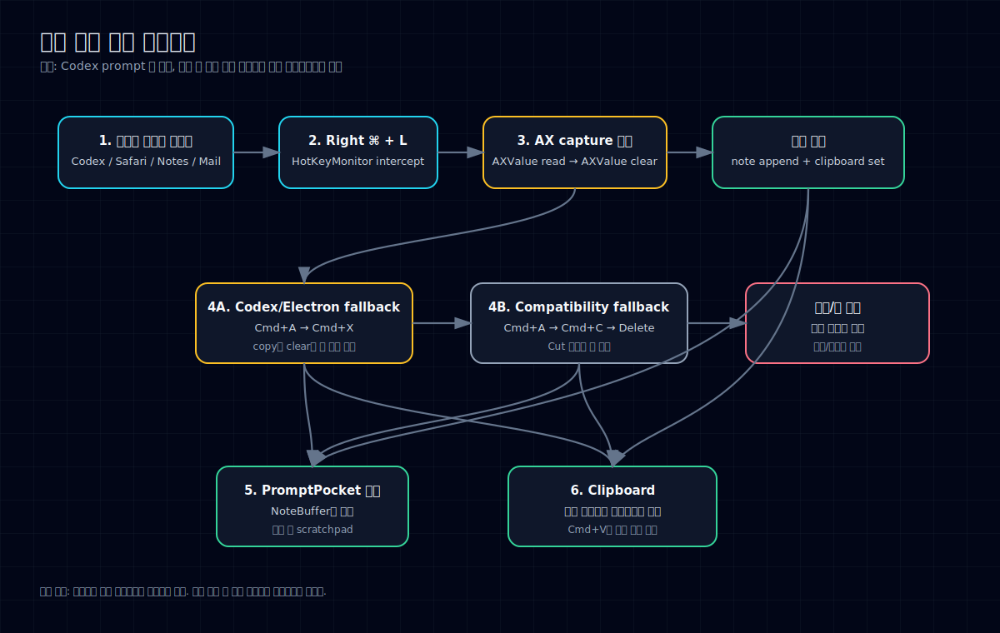

# PromptPocket Architecture

These diagrams are intentionally lightweight so they stay easy to update when the app changes.

## App structure hierarchy

## Core capture process

## Important behavior contract

- Native/macOS-friendly controls should use the Accessibility path first.
- Codex/Electron/Chromium-like prompt fields should fall back to `Command + A` → `Command + X` first.
- `Command + A` → `Command + C` → `Delete` remains as a compatibility fallback.
- Captured text should remain on the clipboard so users can immediately paste it back with `Command + V`.
